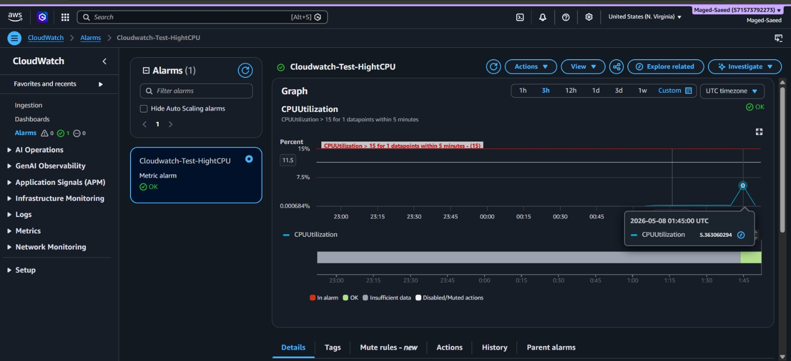
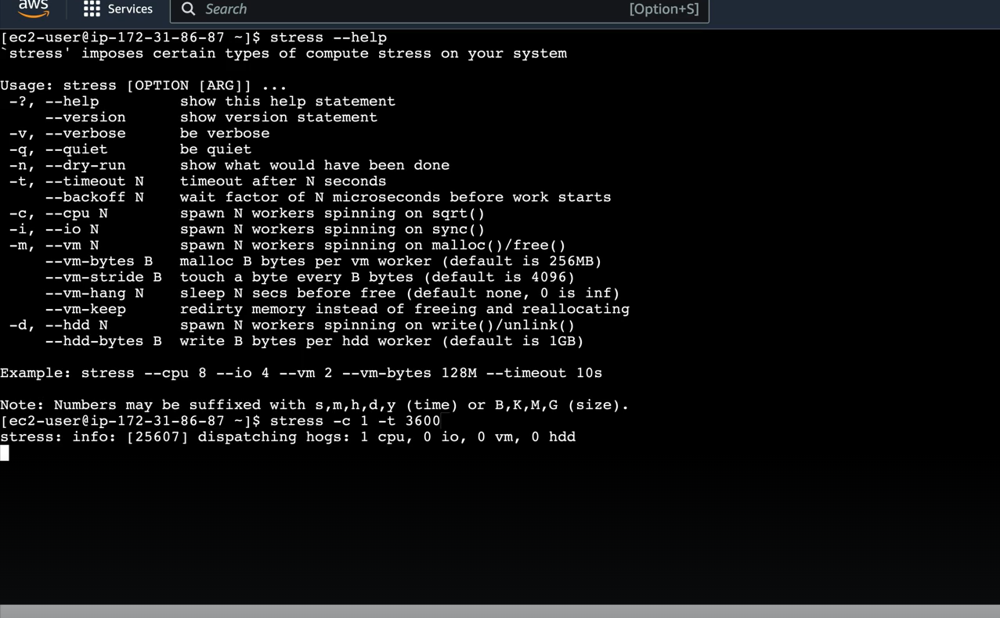
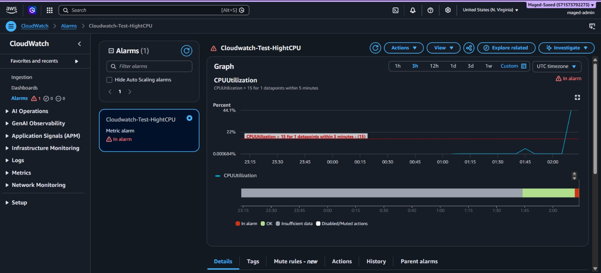
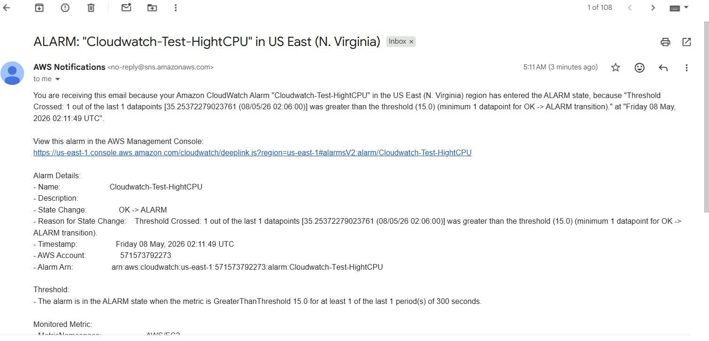

# AWS CloudWatch Monitoring

## Overview

This lab demonstrates AWS CloudWatch monitoring and alerting using an EC2 instance.

The project shows how CloudWatch monitors CPU utilization, triggers alarms, and sends email notifications using Amazon SNS.

---

## Objectives

- Create and monitor an EC2 instance
- Configure CloudWatch alarms
- Monitor CPU utilization metrics
- Trigger alarms when CPU usage exceeds a threshold
- Send email notifications using Amazon SNS
- Simulate high CPU usage using the stress tool

---

## Services Used

- Amazon EC2
- Amazon CloudWatch
- Amazon SNS

---

## Configuration

| Setting | Value |
|---|---|
| Metric | CPUUtilization |
| Threshold | 15% |
| Period | 5 Minutes |
| Alarm State | OK → ALARM |
| Notification Method | Email (SNS) |

---

## Testing

The following command was used to simulate high CPU usage on the EC2 instance:

```bash
stress --cpu 1 --timeout 300s
```

This command increases CPU utilization for 5 minutes.

---

## Results

- CloudWatch detected high CPU usage
- The alarm state changed from OK to ALARM
- Amazon SNS sent an email notification successfully
- After CPU usage dropped, the alarm returned to OK state automatically

---

## Screenshots

### CPU Graph Before Stress


### Stress Command Running


### CPU Graph After Stress


### Email Alert

