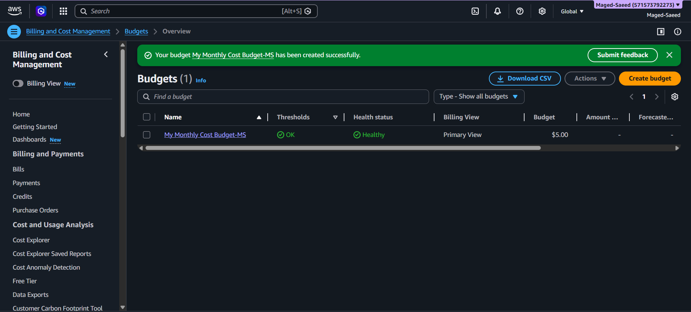

# AWS Cost Management

## Overview
This project focuses on setting up AWS Budgets to monitor cloud spending and receive alerts when costs approach the defined limit.

## Objectives
- Monitor monthly AWS spending
- Configure automated billing alerts
- Improve cloud cost awareness and governance

## Technical Implementation
- Budget Type: Monthly Cost Budget
- Budget Limit: $5 USD
- Alert Thresholds:
  - 85% actual usage
  - 100% actual usage
  - Forecasted over-budget alert
- Notification Method: Email alerts

## Services Used
- AWS Budgets
- AWS Billing and Cost Management

## Budget Configuration

*Figure 1: AWS Monthly Cost Budget configured successfully with alert thresholds and healthy status.*
