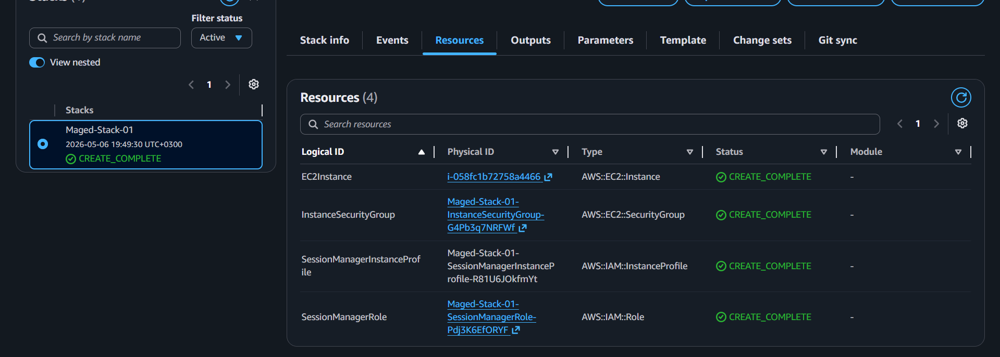
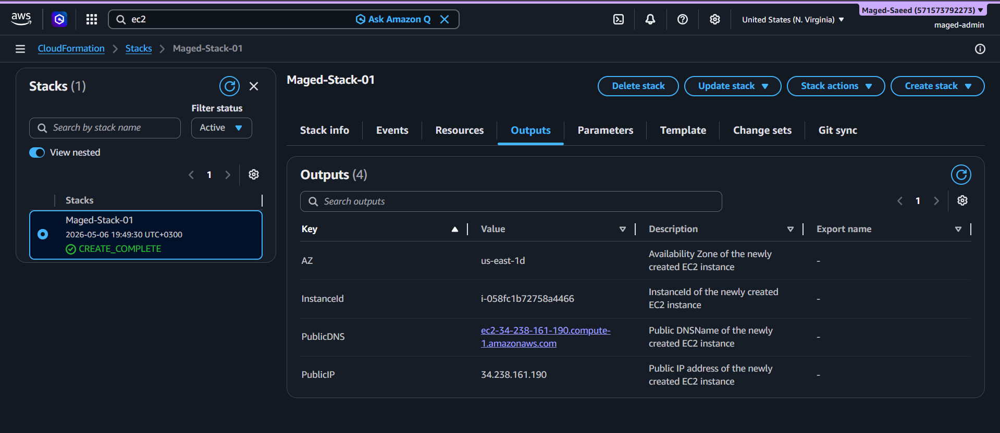
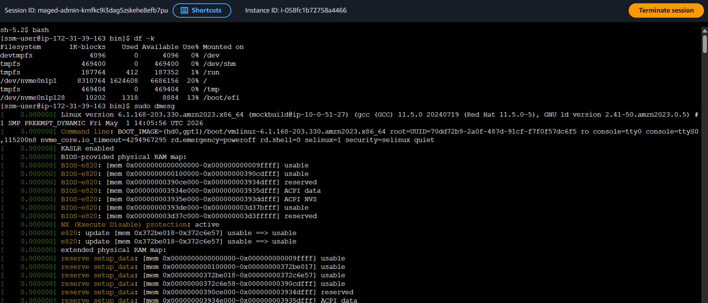

# EC2 Deployment

## 1. Manual EC2 (Old)

- Launched EC2 manually
- Used Amazon Linux
- Connected using SSH

---

## 2. EC2 using CloudFormation (NEW)

### What I did
- Created EC2 using CloudFormation
- Attached IAM Role for SSM
- Connected using Session Manager (no SSH)

### Files
- Template: templates/ec2-ssm.yaml

### Screenshots

