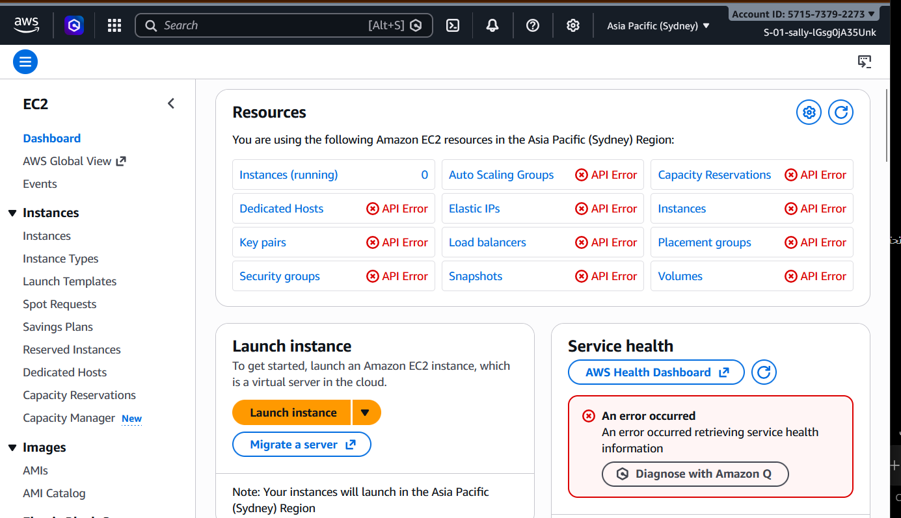
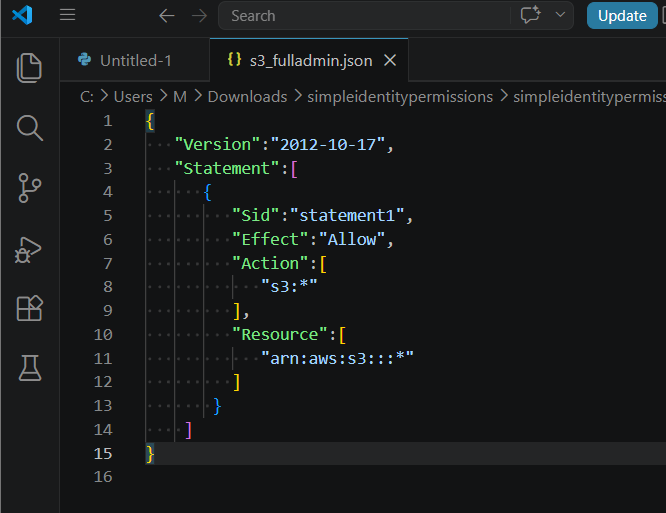
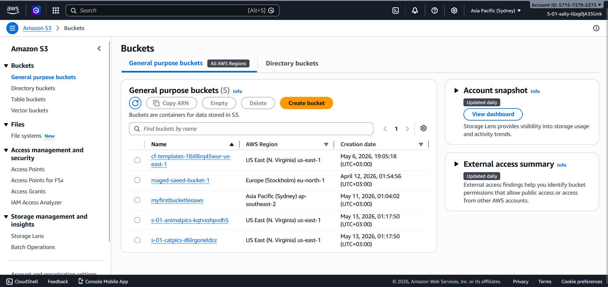
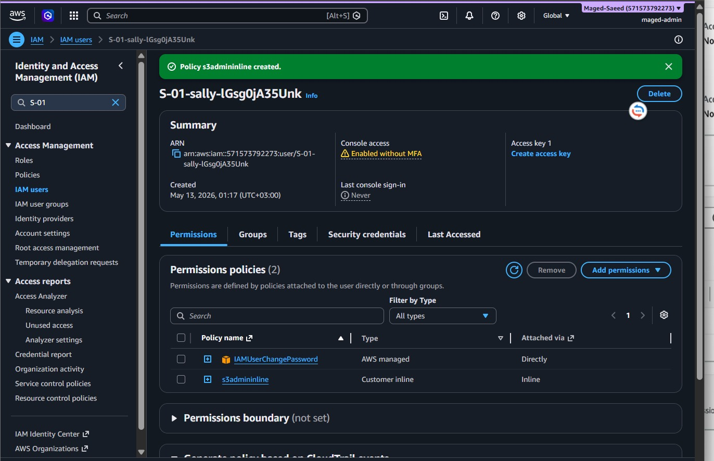
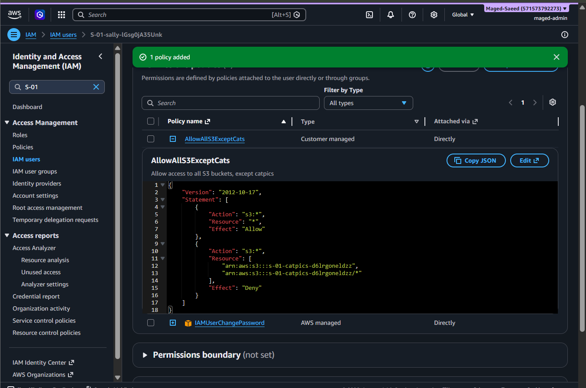
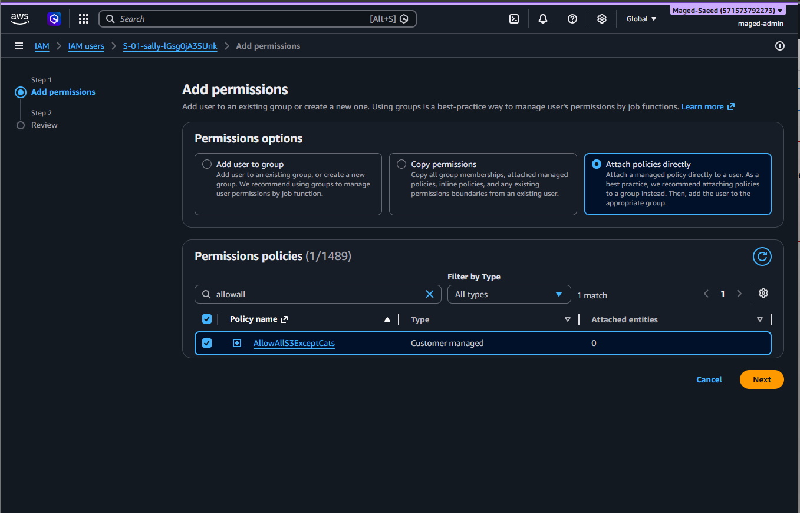
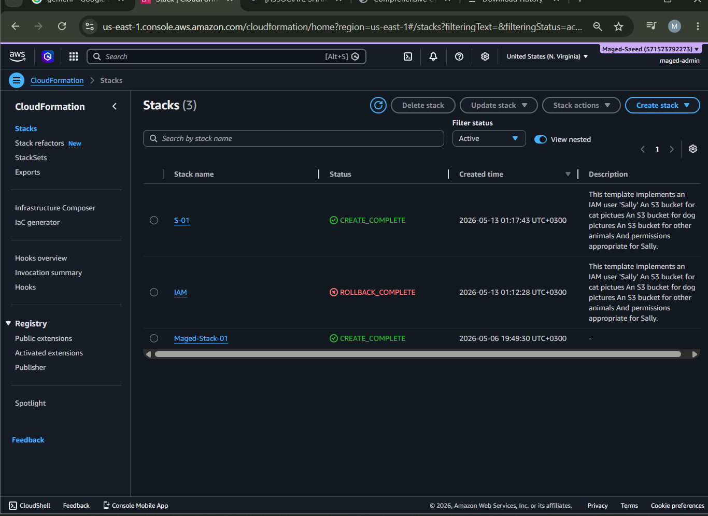
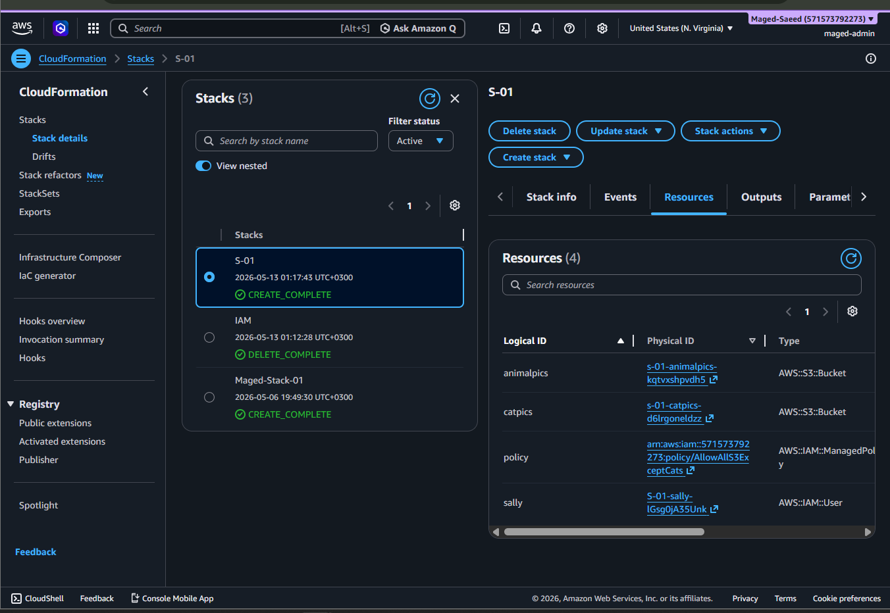

# AWS IAM Simple Identity Permissions Lab

## Overview

This project demonstrates IAM permission management in AWS using inline policies, customer managed policies, Amazon S3 access control, and CloudFormation resources.

The lab focuses on validating how AWS evaluates permissions across different policy types and how access behavior changes depending on attached policies and resource definitions.

---

## Environment

- AWS IAM
- Amazon S3
- AWS CloudFormation
- Amazon EC2
- Visual Studio Code

---

## Objectives

- Create and manage IAM users
- Configure inline and managed IAM policies
- Apply S3 permissions using IAM
- Validate bucket access behavior
- Deploy IAM-related resources using CloudFormation
- Review permission effects across AWS services

---

## Architecture Summary

The environment includes:

- IAM user with custom permissions
- Customer managed IAM policy
- Inline IAM policy
- S3 buckets with different access scopes
- CloudFormation stack provisioning AWS resources

---

## IAM Policy Example

Example policy used during the lab:

```json
{
  "Version": "2012-10-17",
  "Statement": [
    {
      "Sid": "statement1",
      "Effect": "Allow",
      "Action": [
        "s3:*"
      ],
      "Resource": [
        "arn:aws:s3:::*"
      ]
    }
  ]
}
```

---

## Screenshots

### EC2 API Permission Error Dashboard



---

### S3 Full Access Inline Policy JSON



---

### Amazon S3 Buckets Overview



---

### IAM Inline Policy Attached



---

### Customer Managed Policy JSON



---

### Attach Custom Policy To User



---

### CloudFormation Stack Overview



---

### CloudFormation Stack Resources



---
