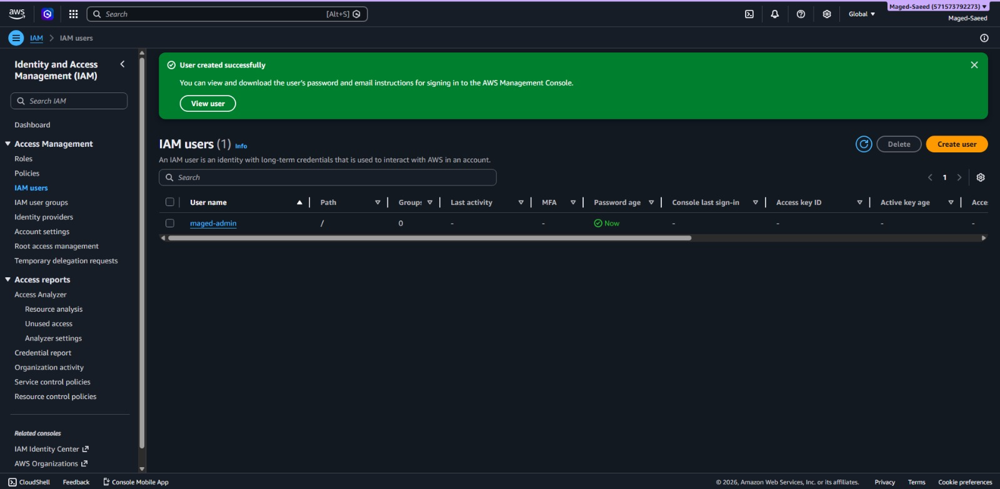

# IAM Setup (AWS)

## What I did
- Created AWS account
- Enabled MFA for root user
- Created account alias
- Created IAM admin user (maged-admin)
- Attached AdministratorAccess policy
- Enabled MFA for IAM user
- Logged in using IAM user instead of root

## Why this matters
- Root account is not used for daily work (security best practice)
- IAM user provides controlled access
- MFA adds extra protection

## Notes
- Always use IAM user, not root
- Use least privilege in real environments (not full admin)

## Screenshot

## Related Work

- [AWS CLI Configuration](aws-cli.md)
