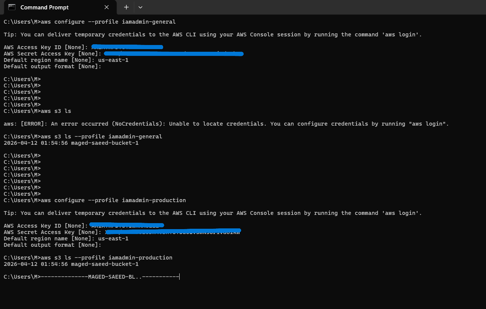

# AWS CLI Configuration with IAM User

## Overview

Configured AWS CLI to securely access AWS services using an IAM user instead of the root account.

---

## Steps Performed

### 1. Installed AWS CLI

Verified installation:

```bash
aws --version
```

---

### 2. Generated Access Keys

* Created Access Key for IAM user `maged-admin`
* Used for programmatic access (CLI)

---

### 3. Configured AWS CLI Profiles

#### General Profile

```bash
aws configure --profile iamadmin-general
```

#### Production Profile

```bash
aws configure --profile iamadmin-production
```

---

## Configuration Details

* Region: us-east-1
* Output format: json

---

## Testing

List S3 buckets:

```bash
aws s3 ls --profile iamadmin-general
aws s3 ls --profile iamadmin-production
```

---

## Key Concepts

* IAM User: secure identity instead of root
* Access Keys: used for CLI authentication
* AWS CLI: command-line tool for AWS
* Profiles: allow switching between environments

---

## Notes

* Both profiles currently use the same IAM user (lab setup)

---

### Output



## Result

Successfully connected AWS CLI and executed commands using named profiles.
