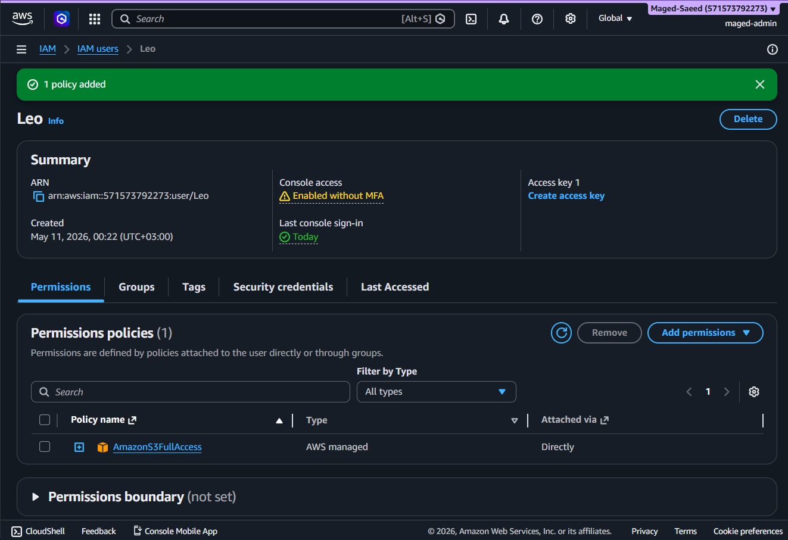
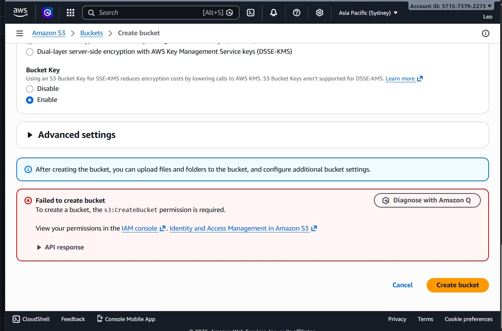
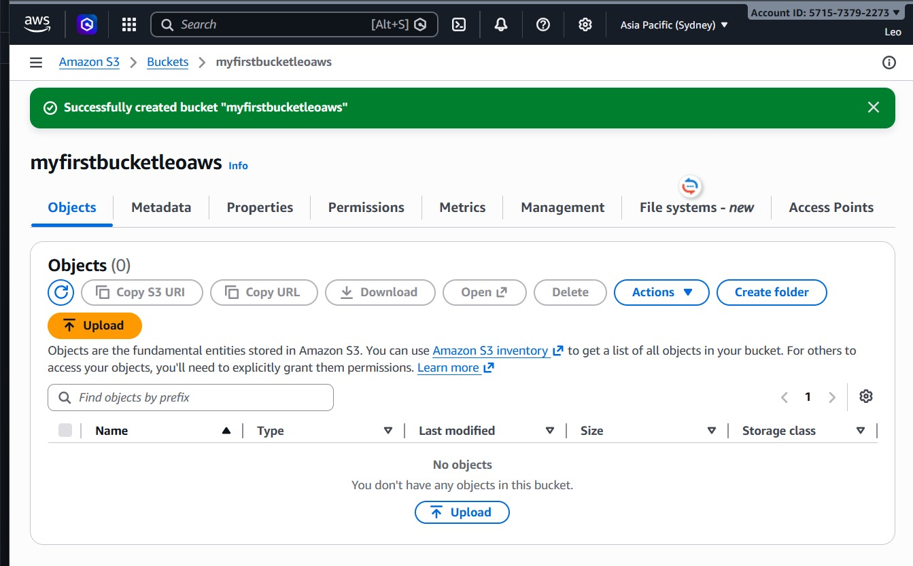
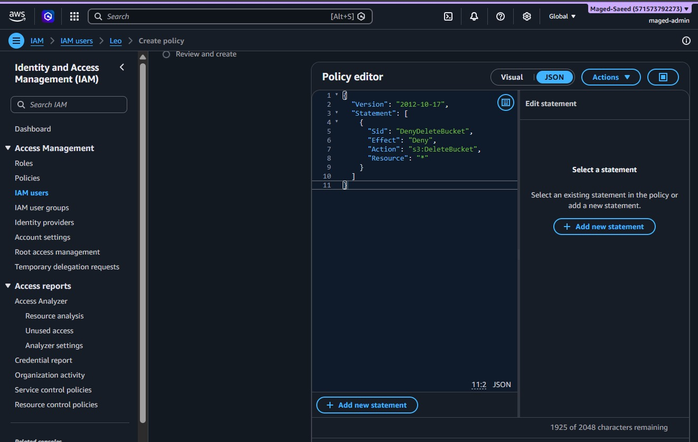

# AWS IAM Explicit Deny Policy Lab

## Overview
This lab demonstrates how AWS IAM policy evaluation works when both Allow and Explicit Deny permissions exist for the same user.

The project focuses on understanding the priority of Explicit Deny in AWS Identity and Access Management (IAM).

---

## Objectives
- Understand AWS IAM policy evaluation logic
- Test Amazon S3 access permissions
- Apply managed and custom IAM policies
- Demonstrate how Explicit Deny overrides Allow permissions

---

## Environment
- AWS IAM
- Amazon S3
- IAM User: `Leo`
- AWS Managed Policy: `AmazonS3FullAccess`

---

## Lab Steps

### 1. Attached S3 Full Access Policy
Attached the AWS managed policy `AmazonS3FullAccess` to the IAM user.



---

### 2. Attempted S3 Bucket Creation
Initially tested bucket creation permissions.



---

### 3. Successfully Created S3 Bucket
Created an Amazon S3 bucket after verifying permissions.



---

### 4. Created Explicit Deny Policy
Created a custom IAM policy using JSON to explicitly deny the `s3:DeleteBucket` action.

```json
{
  "Version": "2012-10-17",
  "Statement": [
    {
      "Sid": "DenyDeleteBucket",
      "Effect": "Deny",
      "Action": "s3:DeleteBucket",
      "Resource": "*"
    }
  ]
}
```



---

## Key Learning
AWS always prioritizes Explicit Deny over Allow permissions during policy evaluation.

Even when a user has `AmazonS3FullAccess`, the user cannot delete S3 buckets if an Explicit Deny policy exists for `s3:DeleteBucket`.

---

## Skills Demonstrated
- AWS IAM
- IAM Policies
- Policy Evaluation Logic
- JSON IAM Policies
- Amazon S3 Permissions
- Access Control
- Cloud Security Fundamentals

---

## Result
Successfully demonstrated that Explicit Deny overrides Allow permissions in AWS IAM.


## Important IAM Rule

AWS policy evaluation follows a simple rule:

**Explicit Deny always overrides Allow**

This means that even if a user has powerful permissions like `AdministratorAccess` or `AmazonS3FullAccess`, they still cannot perform an action that is explicitly denied by another policy.

### Example

If a policy contains this rule:

```json
{
  "Effect": "Deny",
  "Action": "s3:DeleteObject",
  "Resource": "*"
}
