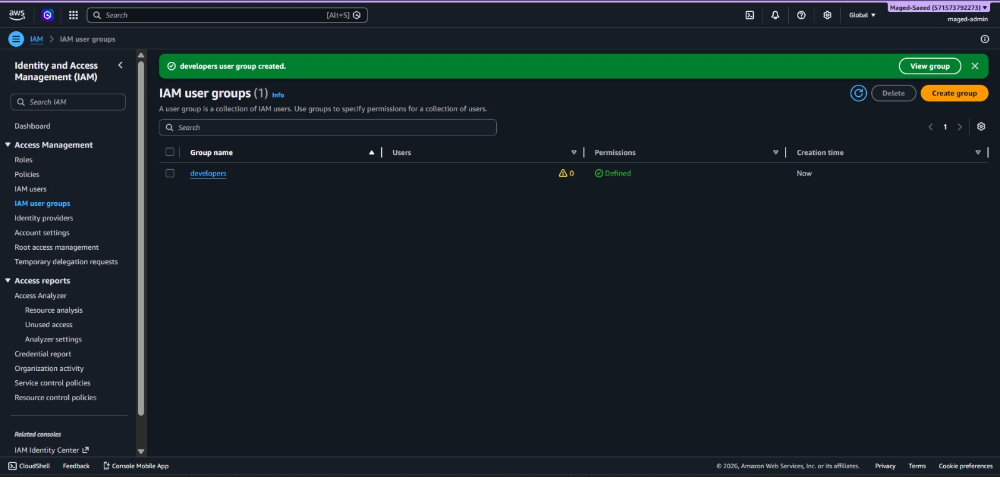

# IAM Groups

## Overview
Created an IAM user group named `developers` and configured group-based permission management in AWS IAM.

## Actions Performed
- Created IAM group: `developers`
- Configured permissions for the group
- Verified group creation from AWS Console

## Screenshot

### IAM Groups Architecture

