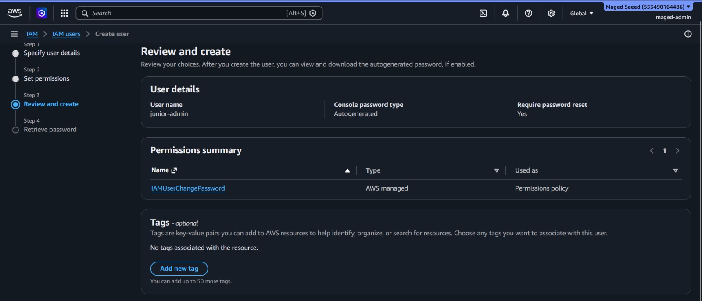
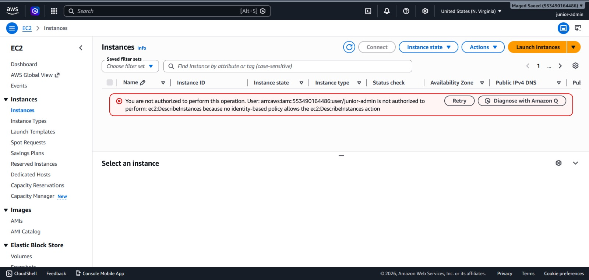
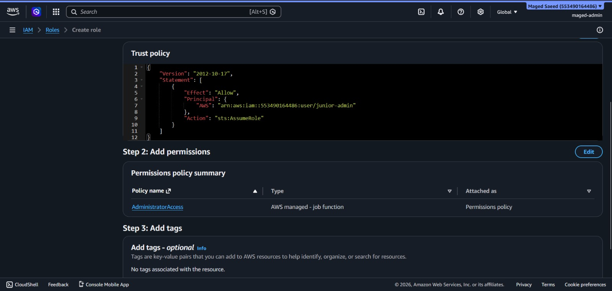
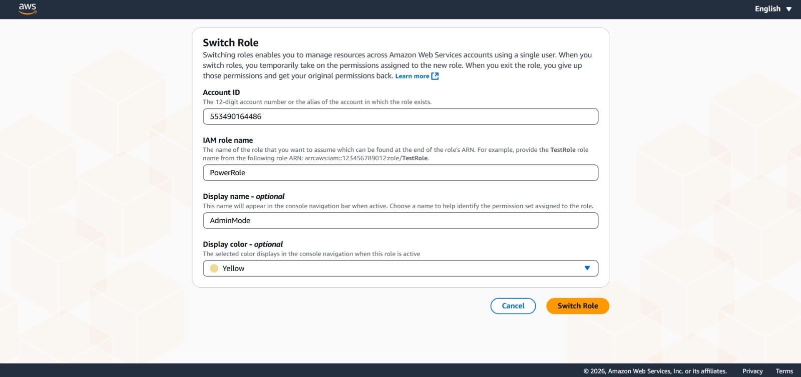
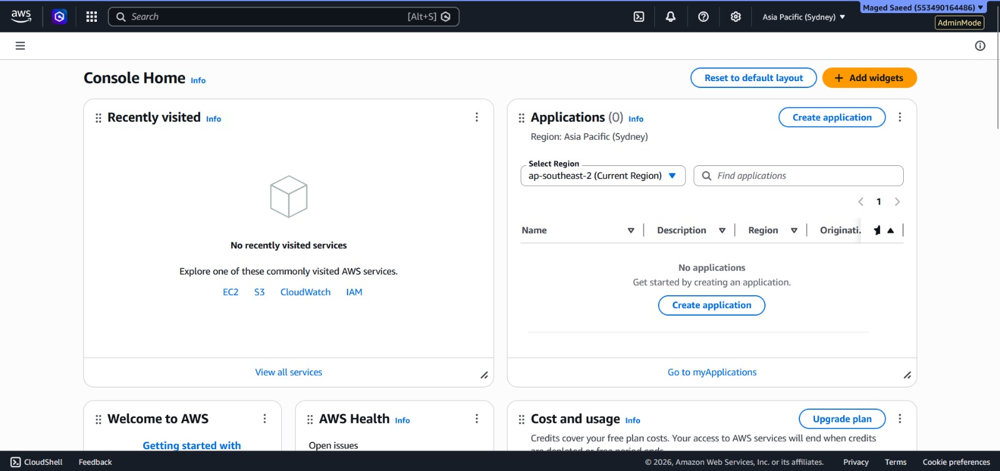

# AWS IAM AssumeRole Lab

## Architecture

```text
+-------------------+
|   junior-admin    |
|    IAM User       |
+---------+---------+
          |
          | AssumeRole
          v
+-------------------+
|     PowerRole     |
| AdministratorRole |
+---------+---------+
          |
          v
+-------------------+
|   AWS Resources   |
|   EC2 / IAM / S3  |
+-------------------+
```

---

# Workflow

```text
1. Create restricted IAM user
2. Deny EC2 access
3. Create PowerRole
4. Add trust policy
5. Switch Role
6. Get temporary admin access
```

---

# Trust Policy

```json
{
  "Version": "2012-10-17",
  "Statement": [
    {
      "Effect": "Allow",
      "Principal": {
        "AWS": "arn:aws:iam::553490164486:user/junior-admin"
      },
      "Action": "sts:AssumeRole"
    }
  ]
}
```

---

# Screenshots

## IAM User Creation


## Access Denied


## Trust Policy + Admin Policy


## Switch Role


## Admin Mode


---

# Skills Practiced

- IAM Users
- IAM Roles
- AssumeRole
- AWS STS
- Trust Policies
- Temporary Credentials
- RBAC
- Least Privilege
```
