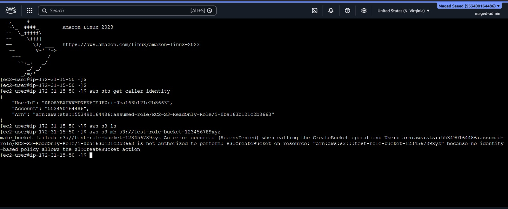

# AWS IAM Role Integration with EC2 and S3

## Project Overview
Implemented and validated AWS IAM Role integration with Amazon EC2 to provide secure temporary access to Amazon S3 without using static AWS access keys.

## Architecture
- Amazon EC2
- IAM Role
- AWS STS
- Amazon S3
- Default VPC
- Security Group

## Implemented Configuration
- Created IAM Role for EC2 trusted entity
- Attached `AmazonS3ReadOnlyAccess` managed policy
- Attached IAM Instance Profile to EC2 instance
- Launched Amazon Linux EC2 instance
- Validated temporary credentials using AWS STS
- Tested S3 authorization and least-privilege enforcement

## Validation Commands

### Verify assumed role identity
```bash
aws sts get-caller-identity
```

### Verify S3 read access
```bash
aws s3 ls
```

### Verify permission restriction
```bash
aws s3 mb s3://test-role-bucket-123456789xyz
```

## Security Validation
The EC2 instance successfully assumed the IAM role using temporary STS credentials.

Bucket creation was denied as expected because the attached policy only grants read-only access to Amazon S3 resources.

This confirms:
- Proper IAM Role attachment
- Successful STS token generation
- Least privilege enforcement
- No static credentials exposure

## Key AWS Concepts Demonstrated
- IAM Roles
- AssumeRole
- AWS STS
- EC2 Instance Profiles
- Least Privilege Access Model
- Identity-Based Policies
- S3 Authorization Controls

## Screenshot


