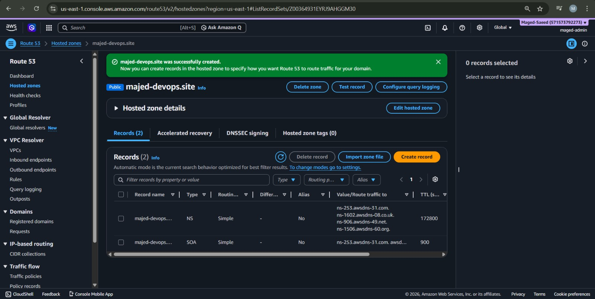
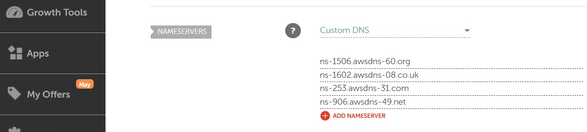
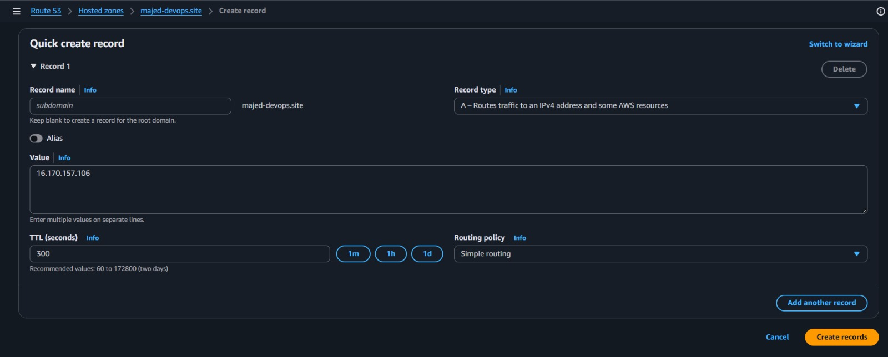
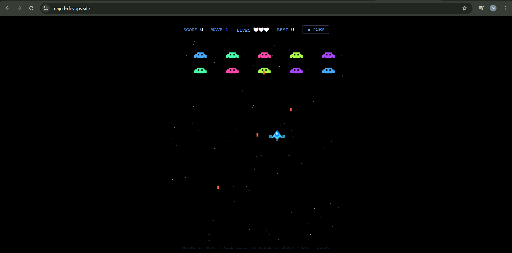

# AWS Route 53 and EC2 Domain Integration

## Overview

This project demonstrates how to connect a custom domain from Namecheap to an AWS EC2 instance using Amazon Route 53.

The setup included creating a hosted zone, updating nameservers, and configuring DNS records to point the domain to a running EC2 instance.

---

# Services Used

* Amazon EC2
* Amazon Route 53
* Namecheap DNS

---

# Project Tasks

## 1. Created a Hosted Zone in Route 53

A public hosted zone was created for the domain:

```text
majed-devops.site
```

AWS automatically generated NS and SOA records for DNS management.

### Screenshot



---

## 2. Updated Namecheap Nameservers

The domain nameservers were changed from Namecheap BasicDNS to AWS Route 53 nameservers.

Example Route 53 nameservers:

```text
ns-253.awsdns-31.com
ns-1602.awsdns-08.co.uk
ns-906.awsdns-49.net
ns-1506.awsdns-60.org
```

This transferred DNS management from Namecheap to Route 53.

### Screenshot



---

## 3. Configured DNS A Record

An A record was created inside Route 53 to point the domain to the EC2 public IPv4 address.

Example:

```text
majed-devops.site → IP
```

This allowed the domain to access the EC2 instance through the browser.

### Screenshot



---

## 4. Connected Domain to EC2

The EC2 instance was started and connected successfully to the custom domain using Route 53 DNS routing.

### Screenshot



---

# Skills Demonstrated

* AWS Route 53
* DNS management
* Hosted zones
* Domain and nameserver configuration
* EC2 public IP mapping
* Namecheap integration with AWS

---

# Result

Successfully connected a custom Namecheap domain to an AWS EC2 instance using Amazon Route 53.
